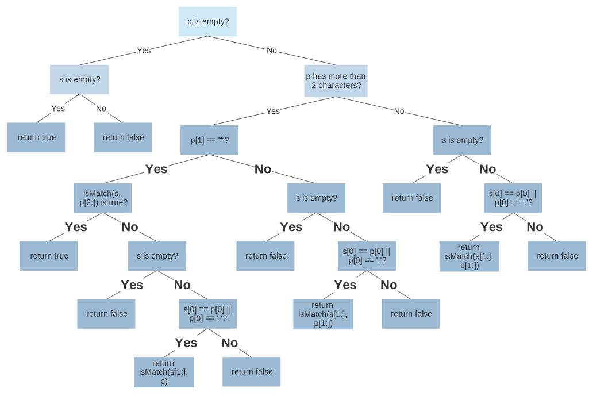

## 01. Two Sum
### Approach 1: Brute Force
Time Complexity: O(N^2), Space Complexity: O(1)

Runtime: **540 ms**, faster than 5.14% of C++ online submissions for Two Sum.

Memory Usage: **9.4 MB**, less than 73.20% of C++ online submissions for Two Sum.

+ Check all the pairs

### Approach 2: One-pass Hash Table
Time Complexity: O(N), Space Complexity: O(N)

Runtime: **4 ms**, faster than 99.94% of C++ online submissions for Two Sum.

Memory Usage: **10.3 MB**, less than 27.80% of C++ online submissions for Two Sum.

+ For a given number, look up its complement's index using hash table

## 03. Longest Substring Without Repeating Characters
### Approach 1: Sliding Window

Runtime: **24 ms**, faster than 60.85% of C++ online submissions for Longest Substring Without Repeating Characters.

Memory Usage: **12.6 MB**, less than 63.06% of C++ online submissions for Longest Substring Without Repeating Characters.

+ Mark the head and tail of the longest substring with two points. Since the longest substing without repeating characters is also a substring internally, if the tail pointer moves to the right and encounters a character that has already appears in the marked substring, the pointer of head only needs to move to the right to meet the condition.

+ C++ set

### Approach 2: Sliding Window Optimized
Time Complexity: O(N), Space Complexity: HashMap O(min(m, n)), Table O(m), m is the size of the charset

Runtime: **20 ms**, faster than 77.60% of C++ online submissions for Longest Substring Without Repeating Characters.

Memory Usage: **10.8 MB**, less than 75.30% of C++ online submissions for Longest Substring Without Repeating Characters.

+ Build a hashmap to store the mapping of content to subscrtips.
+ The `max` function is used to filter out elements with subscripts less than l

## 04. Median of Two Sorted Arrays
### Approach 1: Recursive Approach
Time Complexity: O(log(m+n)), Space Complexity: O(1)

Runtime: **20 ms**, faster than 92.31% of C++ online submissions for Median of Two Sorted Arrays.

Memory Usage: **9.8 MB**, less than 67.90% of C++ online submissions for Median of Two Sorted Arrays.

+ Cut two arrays into 2 parts.
+ 1. the length of left parts = the length of right parts
+ 2. the maximum element in left parts <= the minimum element in right parts
+ binary search
+ See details [here](https://leetcode.com/articles/median-of-two-sorted-arrays/)

## 05. Longest Palindromic Substring

### Approach 1: Expand from the center to the both sides
Runtime: **24 ms**, faster than 70.13% of C++ online submissions for Longest Palindromic Substring.

Memory Usage: **12.4 MB**, less than 50.17% of C++ online submissions for Longest Palindromic Substring.

+ Check whether it is a palindrome while expanding from the center to both sides
+ divide into odd and even cases

## 10. Regular Expression Matching

### Approach 1: Recursion
Runtime: **212 ms**, faster than 21.85% of C++ online submissions for Regular Expression Matching.

Memory Usage: **15.6 MB**, less than 17.34% of C++ online submissions for Regular Expression Matching.

+ Adding the start position like `isMatch(string s, string p, int ss=0, int ps=0)` is not recommended.

### Approach 2: Dynamic Programming
Runtime: **12 ms**, faster than 67.86% of C++ online submissions for Regular Expression Matching.

Memory Usage: **21.6 MB**, less than 5.16% of C++ online submissions for Regular Expression Matching.

+ `dp[i][j]`: whether s[i:] matches p[j:] or not

#### 1. Top-Down
+ `i` starts from 0 to s.length(), while `j` starts from 0 to p.length()

#### 2. Bottom-up
Runtime: **0 ms**, faster than 100.00% of C++ online submissions for Regular Expression Matching.

Memory Usage: **8.3 MB**, less than 94.97% of C++ online submissions for Regular Expression Matching.

+ `i` starts from s.length() to 0, while `j` starts from p.length() to 0
+ default: `dp[s.length()][p.length()] = true;`

## 11. Container With Most Water
### Approach 1: Brute Force
### Approach 2: Two Pointer Approach
Time Complexity: O(N), Space Complexity: O(1)

Runtime: **16 ms**, faster than 97.98% of C++ online submissions for Container With Most Water.

Memory Usage: **9.9 MB**, less than 55.66% of C++ online submissions for Container With Most Water.

+ Move two pointers inward from both sides. If a specfic move is unlikely to have better results in the future, the pointer will not move.

## 22. Generate Parantheses
### Approach 1: Brute Force
Time: O(N * 2^(2N)) Space: O(N * 2^(2N))

+ Generate all sequences and check whether a sequence is valid

### Approach 2: Backtracking
Time: O((4^N) / sqrt(N)) Space: O((4^N) / sqrt(N))

Runtime: **8 ms**, faster than 85.74% of C++ online submissions for Generate Parentheses.

Memory Usage: **17.5 MB**, less than 25.55% of C++ online submissions for Generate Parentheses.

+ Keep track of the number of opening and closing brackets we have placed so far, and add brackets only when we know it will remain a valid sequence

### Approach 3: Closure Number
Time: O((4^N) / sqrt(N)) Space: O((4^N) / sqrt(N))

Runtime: **8 ms**, faster than 84.70% of C++ online submissions for Generate Parentheses.

Memory Usage: **14.6 MB**, less than 72.60% of C++ online submissions for Generate Parentheses.

+ For each closure number `c`, the starting and ending brackets must be at index `c` and `2 * c + 1`. The `2*c` elements between must also be a valid sequence, plus the rest of the elements must be a valid sequence.

## 31. Next Permutation
### Approach 1: Brute Force
Time: O(N!) Space: O(N)

### Approach 2: Single Pass Approach
Time: O(N) Space: O(1)

Runtime: **8 ms**, faster than 92.77% of C++ online submissions for Next Permutation.

Memory Usage: **8.5 MB**, less than 89.81% of C++ online submissions for Next Permutation.

Cases

+ `x x x 2 3` => `x x x 3 2`
+  `x x x a b c1 c2 ...`, where b > a and b > c1 > c2 > ... => `x x x c_i ... c_{i-1} a ... c2 c1 b` (find i that satisfies c\_i > a and c\_{i+1} <= a); 
+ `4 3 2 1` => `1 2 3 4`

## 32. Longest Valid Parentheses
### Approach 1: Expand from the center to both sides
Runtime: **140 ms**, faster than 7.43% of C++ online submissions for Longest Valid Parentheses.

Memory Usage: **9.2 MB**, less than 91.05% of C++ online submissions for Longest Valid Parentheses.

+ Pay attention to the array index out of bounds error
+ The basic idea is similar to the even case in Longest Palindromic Substring
+ Try moving to left first, and move to right afterwards

### Approach 2: Brute Force
Runtime: **628 ms**, faster than 5.10% of C++ online submissions for Longest Valid Parentheses.

Memory Usage: **9 MB**, less than 97.53% of C++ online submissions for Longest Valid Parentheses.

+ For current position, check parentheses to the end. O(N^2)

+ Use `top` integer to check if `(` and `)` matches. `top` should not be less than 0

**problems**

`((((((...(` takes O(N^2) times.

### Approach 3: Without extra space (top.cpp)
Time Complexity: O(N), Space Complexity: O(1)

Runtime: **4 ms**, faster than 99.28% of C++ online submissions for Longest Valid Parentheses.

Memory Usage: **9.2 MB**, less than 90.71% of C++ online submissions for Longest Valid Parentheses.

+ **Traverse string from the left towards the right and then traverse from the right towards the left.**: if traverse only once, `(()` is a problem.

+ Use `top` or `left`, `right` which is used by LeetCode solution to capture the numbers of parentheses

+ If the `top` is less than 0, then we should reset `top` to 0 and pointer.

### Approach 4: Stack
Time Complexity: O(N), Space Complexity: O(N)

Runtime: **8 ms**, faster than 90.98% of C++ online submissions for Longest Valid Parentheses.

Memory Usage: **9.5 MB**, less than 73.95% of C++ online submissions for Longest Valid Parentheses.

+ Push & Pop corresponds to '(' and ')' respectly
+ To calculate the length of valid parentheses, their indices are required to be store in the stack
+ Push -1 at the begining
+ If ')' is encountered, pop + (if empty push) + subtract

### Approach 5: Dynamic Programming
Time Complexity: O(N), Space Complexity: O(N)

Runtime: **8 ms**, faster than 90.98% of C++ online submissions for Longest Valid Parentheses.

Memory Usage: **9.3 MB**, less than 89.47% of C++ online submissions for Longest Valid Parentheses.

+ i-th element of `dp` represents the length of longest valid parentheses ending at s[i]
+ `dp[i]` depends on `dp[i - 1]`, `dp[i - 2]` and `dp[i - dp[i-2] - 2]`.

## 33. Search in Rotated Array
### Approach 1: Binary Search
Time: O(logN)

Runtime: **4 ms**, faster than 93.93% of C++ online submissions for Search in Rotated Sorted Array.

Memory Usage: **8.7 MB**, less than 83.60% of C++ online submissions for Search in Rotated Sorted Array.

+ Find the first element that is just smaller than the first element. Take care of the case that the array is not rotated, such as `[1, 3]`
+ Apply binary search while computing the modulo

## 34. Find First and Last Position of Elements in Sorted Array
### Approach 1: Brute Force
Time: O(N) Space: O(1)

### Approach 2: Binary Search
Time: O(logN) Space: O(1)

Runtime: **8 ms**, faster than 94.92% of C++ online submissions for Find First and Last Position of Element in Sorted Array.

Memory Usage: **10.6 MB**, less than 42.10% of C++ online submissions for Find First and Last Position of Element in Sorted Array.

+ a modified binary search

## 39. Combination Sum
### Approach 1: Backtracking
Runtime: **116 ms**, faster than 7.98% of C++ online submissions for Combination Sum.

Memory Usage: **45.1 MB**, less than 6.39% of C++ online submissions for Combination Sum.

+ Compute the possible numbers of current elements which determine how many can we add it to our list. Then we go to the next element and do the same thing

### Approach 2: Backtracking with Pruning
Runtime: **40 ms**, faster than 25.82% of C++ online submissions for Combination Sum.

Memory Usage: **19.5 MB**, less than 17.09% of C++ online submissions for Combination Sum.

+ Sort the candidates and do not search if current element is larger than target.

## 40. Combination Sum2
### Approach 1: Backtracking with Pruning
Runtime: **16 ms**, faster than 42.37% of C++ online submissions for Combination Sum II.

Memory Usage: **11.1 MB**, less than 31.35% of C++ online submissions for Combination Sum II.

+ Transform combination sum2 problem to combination sum.

## 41. First Missing Positive
### Approach 1: Counting Sort Approach
Runtime: **4 ms**, faster than 87.32% of C++ online submissions for First Missing Positive.

Memory Usage: **8.8 MB**, less than 50.06% of C++ online submissions for First Missing Positive.

+ The first missing positive must be between 1 to N (inclusive)
+ Put the each element in its right place. In this case, keep the rule of `a[i-1] = i`.

## 46. Permutations

### Approach 1: Brute Force

### Approach 2: Backtracking

Runtime: **12 ms**, faster than 90.37% of C++ online submissions forPermutations.

Memory Usage: **9.6 MB**, less than 35.43% of C++ online submissions forPermutations.

+ select next element by swapping

## 51. N-Queens
### Approach 1: Backtracking with Prunning
Runtime: **4 ms**, faster than 99.14% of C++ online submissions for N-Queens.

Memory Usage: **11.7 MB**, less than 28.92% of C++ online submissions for N-Queens.

+ Use int array to represent the positio of queen in a specfic row
+ Select the next position if and only if it is not in the same row, column or diagonal as previous points

